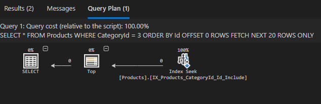
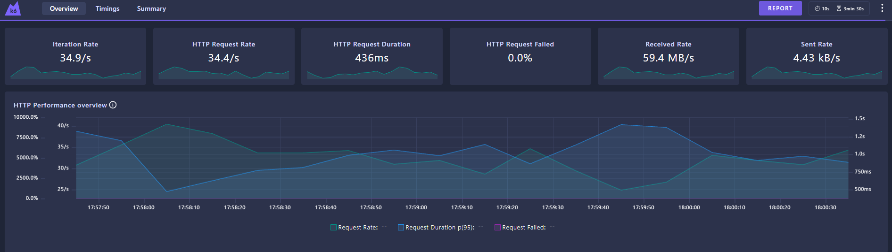
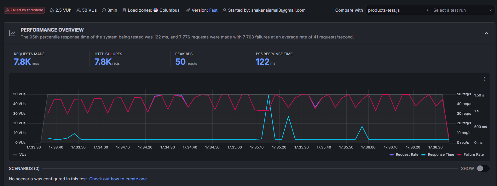

# ProductCatalogAPI (Basic API vs Optimized API)
This repository contains two versions of the EcommerceAPI, both serving the same product catalog but built to demonstrate the impact of API optimization, cloud integration, and load testing.
Both APIs are consumed by the shared frontend ProductCatalogUI.

---
## Purpose of the Project
The goal of this project is to compare a Basic API and an Optimized API under identical conditions, and show how architectural decisions, cloud services, and performance techniques affect:

- Response time
- Scalability
- Resilience under load
- Cost efficiency
- Developer experience

The project highlights how the same domain logic can behave very differently depending on infrastructure, caching, rate limiting, and observability.

---
## ProductCatalogUI - Frontend

This view shows the product catalog page in ProductCatalogUI. The frontend dynamically selects the API version based on the green toggle button, allowing seamless switching between environments.

---

## Clean Architecture Overview
A visual representation of the system’s layered structure — from the Web API down to the Domain and Infrastructure layers.

It illustrates how each layer interacts according to the Clean Architecture principles, ensuring a clear separation of concerns and testability.

---
## Shared Architecture
Both APIs use:

- Clean Architecture (DDD, CQRS + MediatR, EF Core, Repository Pattern)

- Azure Key Vault for all secrets
- Clerk Auth
- Same domain logic and endpoints

This ensures a fair, apples‑to‑apples comparison.

---
## 🚀 API Versions

| Feature / Capability                | Basic API              | Optimized API                               |
|-------------------------------------|-------------------------|----------------------------------------------|
| CRUD Endpoints                      | ✔️                      | ✔️                                            |
| Admin Authentication                | ✔️                      | ✔️                                            |
| Pagination                          | ❌                      | ✔️                                            |
| Filtering                           | ❌                      | ✔️ (CategoryId)                               |
| Database Indexing                   | ❌                      | ✔️ (Composite + INCLUDE index)                |
| Optimized Query Execution           | ❌                      | ✔️ (Index Seek, no Key Lookup)                |
| Database                            | Local Docker SQL        | Azure SQL Database                            |
| Hosting                             | Local                   | Azure App Service                             |
| Azure API Management                | ❌                      | ✔️ (gateway)                                  |
| Rate Limiting                       | ❌                      | ✔️                                            |
| Response Caching                    | ❌                      | ✔️                                            |
| Cloud Logging                       | ❌                      | ✔️ (Application Insights)                             |
| CI/CD                               | ❌                      | ✔️ (GitHub Actions)                           |
| Purpose                             | Baseline comparison     | Optimized, production‑ready                   |

### SQL Indexing

The optimized API uses a composite index on (CategoryId, Id) with included columns to support efficient filtering and pagination. SQL Server performs an Index Seek instead of a Key Lookup, significantly reducing IO and improving performance under load.

---
## 📊 Load Testing (k6)
### Both APIs are tested under identical load:

- Each database contains **5,000 product rows**
- 50 virtual users
- 1 request per second per user
- 3 minutes (~9000 requests)

Measured:
- P95 response time
- Failure rate
- Cache hits/misses
- Rate‑limit events

## Load Test Dashboards

### Basic API – k6 Dashboard

This shows the k6 dashboard results for the Basic API after running the load test script locally.

### Optimized API – Grafana Cloud Overview

This is the Grafana Cloud dashboard for the Optimized API, visualizing request rate, response time, and failure rate.

### Optimized API – Threshold Analysis

This view shows threshold analysis in Grafana Cloud, highlighting cache efficiency, rate limiting, and P95 response time.

---
## Result based on test
- Basic API: higher response times, no caching, and the frontend visibly froze when attempting to load all 5,000 products at once.
- Optimized API: lower and stable P95, caching active via Azure API Management, but heavy rate limiting because all k6 users share one IP.

## 🚀 Improvement Opportunities
- Use distributed load testing to simulate realistic client behavior and avoid single‑IP rate‑limit bias.
- Extend the test duration to capture long‑running performance patterns and stability over time.
- Increase the API Management rate‑limit threshold to better reflect real production traffic.
- Enhance cache hit/miss tracking for clearer visibility into caching efficiency.
- Expand observability with additional custom metrics and logs in Application Insights and Grafana.

---
## 💸 Cost‑Aware Cloud Architecture Decisions
When optimizing the API, I also had to design it to run cost‑efficiently in Azure.
The Optimized API uses several cloud services — Key Vault, API Management, Application Insights, Azure SQL Database, and App Service — and each of these can generate cost under heavy load.
Because of this, I made a few deliberate architectural choices to keep performance high while keeping costs predictable.

### Application Insights Sampling
- During load testing, logging every request becomes expensive.
I enabled adaptive sampling and kept only 5% of telemetry to reduce cost while still capturing reliable performance data.

### Efficient Secret Management
- Key Vault charges per secret retrieval. To avoid repeated lookups, I used a centralized SecretsProvider as a singleton, loading secrets once at startup and reusing them across the app.

### Balancing Performance and Cost
- These choices keep the API fast, observable, and stable under high load — while avoiding unnecessary Azure consumption

---
## 🛠️ How to Run Locally
1. Clone the repository  
2. Start the local SQL database via Docker (`docker-compose up -d`)  
3. Run either API project from Visual Studio or `dotnet run`  
4. The frontend (ProductCatalogUI) will target the API version based on toggle button

---
## 🧰 Tech Stack
- .NET 9  
- EF Core  
- Azure SQL  
- Azure API Management (APIM)  
- Azure Application Insights  
- Azure App Service  
- Azure Key Vault  
- Clerk Authentication  
- k6 (load testing)  
- Grafana Cloud (dashboards & analysis)
---

## Summary
This project demonstrates how cloud‑native optimizations significantly improve API performance, resilience, and observability under load.

